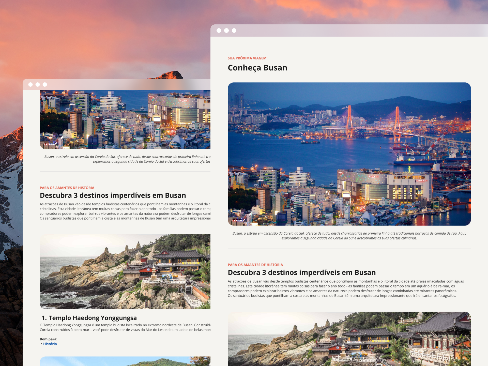

# 🚠 Tourist Location




## 📝 About the project

This project consists of a website that displays information on the city of Busan, South Korea. The site includes sections on the city's history, culture, tourist attractions, and more. It is designed to provide visitors with a comprehensive overview of Busan and its many attractions.

## 👩🏻‍💻 Technologies

This project uses the following technologies:

- HTML
- CSS

## 👀 Live Preview

You can see the project live at the following link: [Tourist Location](https://amanda-santos.github.io/tourist-location/)

## 💻 Prerequisites

Before you begin, make sure you meet the following requirements:

- You have a Windows / Linux / Mac machine;
- You have Git installed and configured.

## ⚙️ Installing `tourist-location`

To install `tourist-location`, follow the steps below:

Clone the repository `tourist-location`

```bash
git clone git@github.com:amanda-santos/tourist-location.git
```

You are ready to go!

## 🚀 Using `tourist-location`

To use `tourist-location`, follow these steps:

Open the `index.html` file in your browser or use a local server (for example, with the Visual Studio Code extension [Live Server](https://marketplace.visualstudio.com/items?itemName=ritwickdey.LiveServer)).

## 📫 Contributing to `tourist-location`

Here's how to contribute to `tourist-location`:

1. Fork this repository.
2. Create a branch: `git checkout -b <branch_name>`.
3. Make your changes and commit them: `git commit -m '<commit_message>'`
4. Push to the original branch: `git push origin tourist-location / <location>`
5. Create the pull request.

Alternatively, see the GitHub documentation on [how to create a pull request](https://help.github.com/en/github/collaborating-with-issues-and-pull-requests/creating-a-pull-request).

## 🤝 Contributors

We thank the following people who contributed to this project:

<table>
  <tr>
    <td align="center">
      <a href="#" title="set the link title">
        <br>
        <sub>
          <b>Amanda Santos</b>
        </sub>
      </a>
    </td>
  </tr>
</table>

## 📝 License

This project is licensed. See the [LICENSE](LICENSE.md) file for more details.
